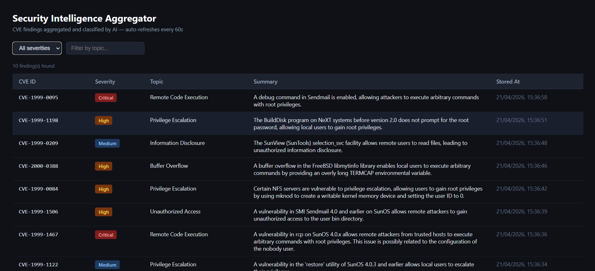

# Security Intelligence Aggregator

A Python backend service that fetches CVE vulnerability data from the NVD API, analyses each entry using an AI agent (Gemini) via an MCP server, and exposes the results through a REST API and web UI.



---

## Architecture

```
AI_Cyber/
├── api/
│   ├── main.py              # FastAPI app — security headers, rate limiting, lifespan
│   ├── limiter.py           # Shared rate limiter instance
│   └── routes/findings.py  # GET /api/findings/, GET /api/findings/{id}
├── db/
│   ├── database.py          # SQLAlchemy engine + session (creates data/ dir automatically)
│   └── models.py            # Finding model
├── scheduler/job.py         # AsyncIOScheduler — runs agent on startup and periodically
├── services/
│   ├── agent.py             # Gemini client + system prompt
│   ├── agent_runner.py      # Async orchestration loop — connects to MCP over SSE
│   ├── mcp_server.py        # MCP server — exposes fetchSecurityData and storeFinding as tools
│   ├── fetcher.py           # NVD API client
│   └── storage.py           # DB read/write logic
├── static/index.html        # Web UI (auto-refreshes every 30s)
├── config.py
└── docker-compose.yml       # Two services: mcp-server (8001) + app (8000)
```

---

## Agent Flow

```
agent_runner connects to mcp_server via HTTP/SSE (MCP protocol)
       │
       ├── list_tools() → discovers fetchSecurityData and storeFinding dynamically
       │
       ├── sends prompt to Gemini with tool schemas
       │
       └── Gemini autonomously decides to:
              │
              ├── call fetchSecurityData → NVD API → 10 CVEs
              │
              └── call storeFinding for each CVE → SQLite
```

---

## MCP Server (separate service)

The MCP server runs as an independent container on port 8001, communicating over SSE (Server-Sent Events). The agent connects to it via `http://mcp-server:8001/sse` and discovers its tools dynamically — the agent has no hardcoded knowledge of what tools exist or how they work.

This means the MCP server can be replaced, extended, or run remotely without touching the agent.

---

## Prompt Design

**System Instructions:**
```
You are an expert cybersecurity analyst.
Call fetchSecurityData to get the latest CVEs, then call storeFinding for each one.
Use CVSS score to classify severity as Low / Medium / High / Critical.
```

**Design decisions:**
- **MCP over SSE** — tools run in a separate container, decoupled from the agent
- **Function calling** over free-text — model returns a schema-validated call
- **Fully agentic** — Gemini decides which tools to call and in what order
- **CVSS score passed to LLM** — anchors severity classification to a standard metric

---

## Setup

```bash
pip install -r requirements.txt
```

Create a `.env` file:
```env
GEMINI_API_KEY=your_key_here
```

Key settings in `config.py`:

| Variable | Default | Description |
|---|---|---|
| `GEMINI_MODEL` | `gemini-2.5-flash` | Model to use |
| `NVD_RESULTS_PER_PAGE` | `10` | CVEs fetched per run |
| `SCHEDULE_INTERVAL_MINUTES` | `1` | How often the agent runs |
| `MCP_SERVER_URL` | `http://localhost:8001/sse` 

---

## Running

### Docker 

```bash
docker compose up --build
```

Starts two containers:
- `mcp-server` on port 8001 — MCP tools (NVD fetch + DB write)
- `security-aggregator` on port 8000 — FastAPI + agent + scheduler

The app waits for the MCP server to be healthy before starting.

---

Once running:

- UI: `http://localhost:8000`
- API: `http://localhost:8000/api/findings/`
- Docs: `http://localhost:8000/docs`
- MCP server: `http://localhost:8001/sse`

---

## API

| Endpoint | Description |
|---|---|
| `GET /api/findings/` | List all findings. Supports `?severity=` and `?topic=` filters |
| `GET /api/findings/{id}` | Get a single finding by CVE ID. Returns 404 if not found |

---

## Security

| Control | Implementation |
|---|---|
| XSS | `escHtml()` on all UI output + `Content-Security-Policy` header |
| Clickjacking | `X-Frame-Options: DENY` |
| MIME sniffing | `X-Content-Type-Options: nosniff` |
| Rate limiting | 60 req/min per IP via slowapi |
| Secrets | API key in `.env`, never hardcoded |

**Security test results**: Done via Claude Code

```
XSS            GET /api/findings/?topic=<script>alert(1)</script> → []
Rate limiting  70 rapid requests vs 60/min limit                  → 12 blocked (429)
```

---

## Data Source

[NIST National Vulnerability Database (NVD)](https://nvd.nist.gov/)
```
https://services.nvd.nist.gov/rest/json/cves/2.0
```
